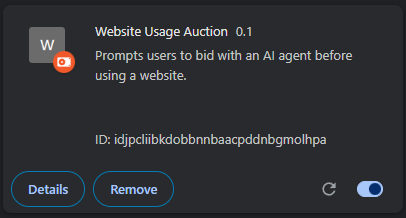
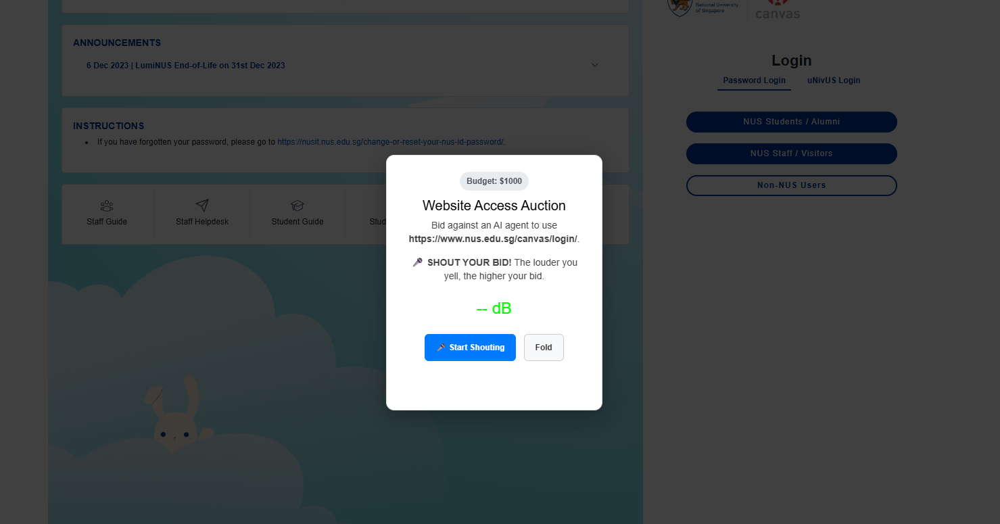
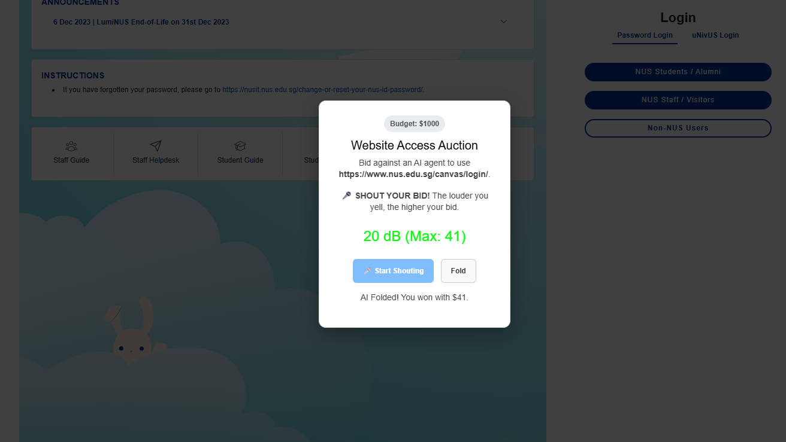
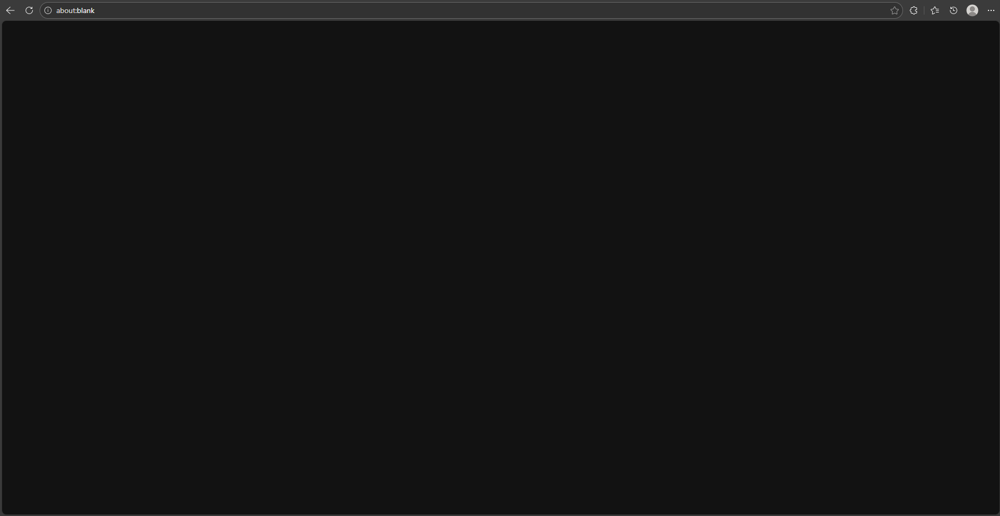

# Bid wURLd
This browser extension lets you bid against AI to access a website.

## Prerequisites
- Python 3.12.x or newer
- An API key from [Interfaze](https://interfaze.ai/)

## Installation
### Server

1. Clone this repo.
```
git clone https://github.com/antonTan96/hack_and_roll_2026.git
cd hack_and_roll_2026
```

2. Create a python virtual environment and activate it.
```
python3 -m venv .venv
source .venv/Scripts/activate
```

3. Install required modules.
```
pip install -r requirements.txt
```

4. Create a `.env` file and paste your OpenAI API key as follows:
```
OPENAI_API_KEY=<YOUR_OPENAI_API_KEY>
```

5. Run the script.
```
python3 backend/main.py
```

### Client
1.  Open chrome://extensions on your Chrome browser and enable the developer mode on the top right corner.
2. On the top left corner, choose `Load unpacked` and select the `frontend` directory. You would see the extension loaded to your Chrome extensions collection.



## Usage
Every time you enter a webpage, you will be challenged by an AI agent to an auction for the use of website. It will show a popup, indicating you to shout your bid, which will be the number of decibels of your shout.



After shouting, your maximum decibel recorded will be used as bid against the AI agent, and the agent may provide a higher bid or fold. If the agent fold, you will win the access to this webpage for the day.



However, if the bidding fails, you will be redirected to `about:blank` every time you access the same webpagg, until it resets the next day.



## About Us
- [Anton Tan Hong Zhi](https://github.com/antonTan96), Computer Science, NUS
- [Ken Lai](https://github.com/Ken-Lai), Computer Science, NUS
- [Desmond Wong Hui Sheng](https://github.com/desmondwong1215), Computer Science, NUS
- [Chong Chin Herng](https://github.com/chin-herng), Computer Science, NUS